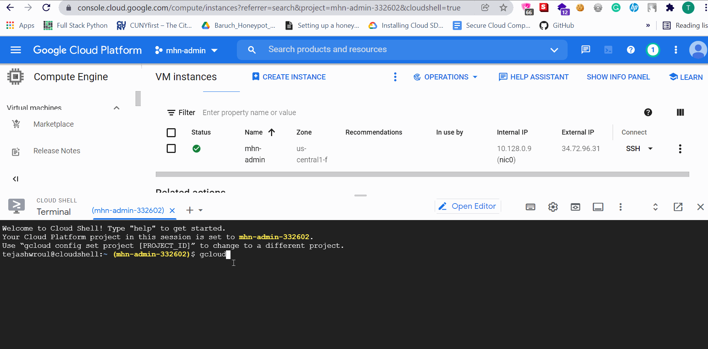
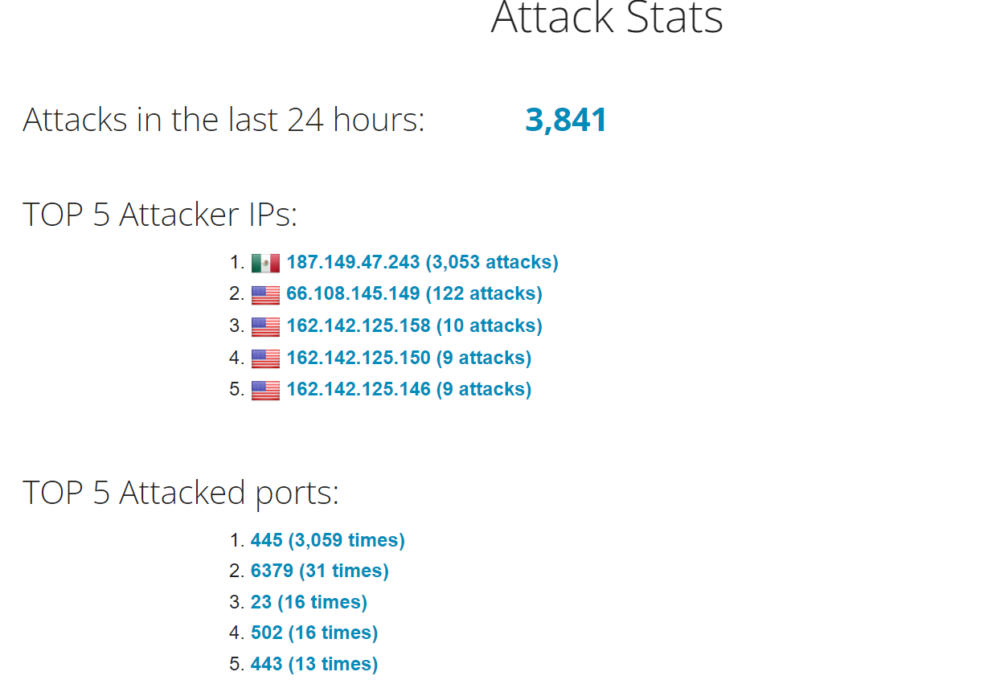
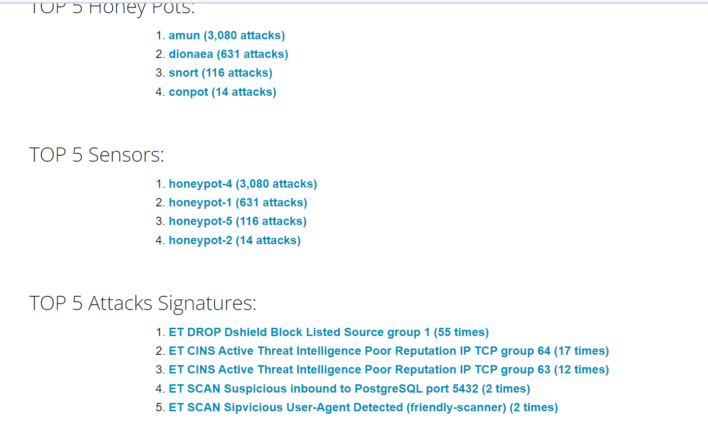
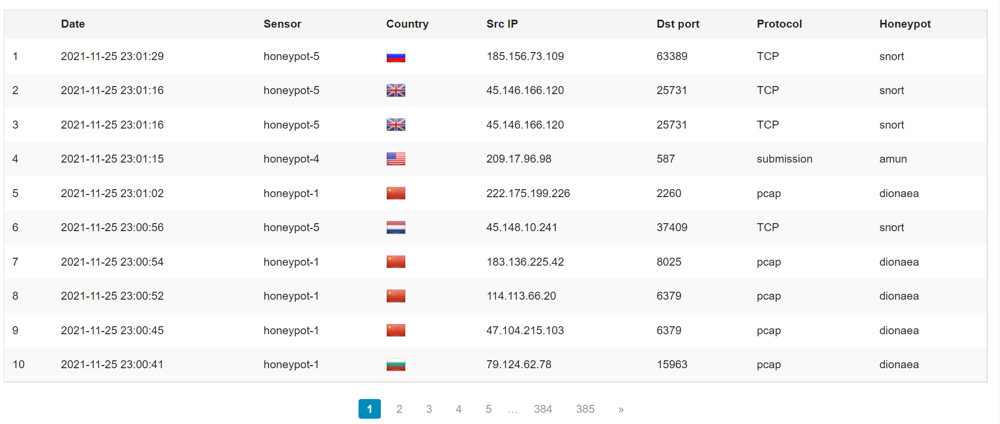

# Honeypot Assignment

**Time spent:** **4** hours spent in total

**Objective:** Create a honeynet using MHN-Admin. Present your findings as if you were requested to give a brief report of the current state of Internet security. Assume that your audience is a current employer who is questioning why the company should allocate anymore resources to the IT security team.

### MHN-Admin Deployment (Required)

**Summary:** How did you deploy it? Did you use GCP, AWS, Azure, Vagrant, VirtualBox, etc.?

Ans. I used Google Cloud Platform to deploy it. I used the google cloud shell terminal in the browser to run the required GCP commands to set up mhn-admin and honeypot-1 VM instances. I followed the steps from milestone 0 to milestone 5 written in the unit 10 assignment tab. 

The following gif shows the mnh-admin installation:

The following gif shows the mhn-admin deployment:

### Dionaea Honeypot Deployment (Required)

**Summary:** Briefly in your own words, what does dionaea do?

Ans. Dionaea is used to trap malware exploiting vulnerabilities exposed by services offered over a network, and ultimately obtain a copy of the malware. Dionaea is an attack to catch vulnerabilies hosts and gather useful infomration like Operating Systems(OS) uptime, malicious traffic patterns,etc. 

The Following gif shows the dionaea-honeypot deployment:

### Database Backup (Required) 

**Summary:** What is the RDBMS that MHN-Admin uses? What information does the exported JSON file record?

*Be sure to upload session.json directly to this GitHub repo/branch in order to get full credit.*

Ans. The RDBMS which MHN-Admin uses is Mongodb. The exported JSON file gives us the following information like Source_ip,TimeStamp,source_port,destination_port,honeypot type and identifier. With these info, we can see from where the attack came from and what type of attack was it. Basically its gives the attack report of all the attacks.

The following sensors were deployed:

The following are my attack stats :

The following are my attack reports :

## Notes

Describe any challenges encountered while doing the assignment.